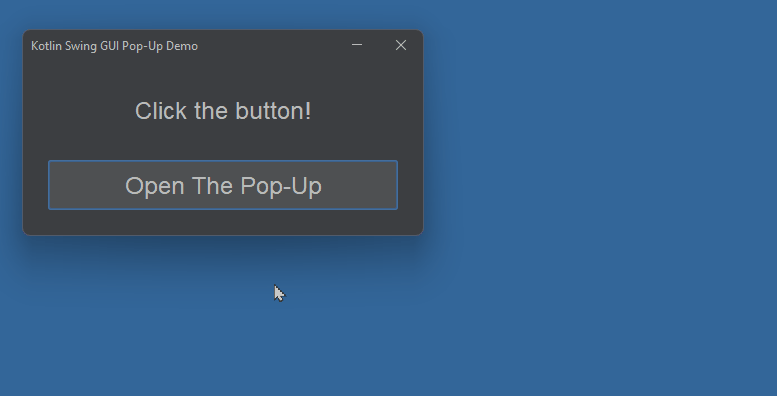

# Kotlin GUI Pop-Up Dialog Demo

This is a demo of how to create and manage a pop-up dialog window as part of your application.

The pop-up is modal - this means that it retains focus, and the main window can't be interacted with until the pop-up is closed.

